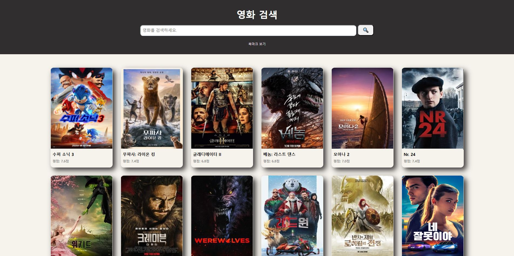
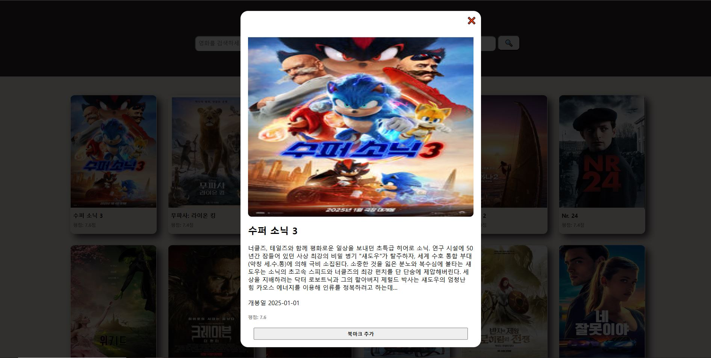

<h2>🔥TMDB API 연동하여 영화 검색 사이트 만들기🔥</h2>
TMDB API를 받아 인기영화를 검색하는 사이트 입니다.


---


## 📽️프로젝트 설명
영화 검색을 간편하게 제공하기 위한 사이트이며, TMDB API를 활용하여 실시간으로 인기영화를 찾아보실 수 있습니다.


---


## 🖼️스크린샷




## 🌟프로젝트 구조 및 기능

```plaintext
project_1st/
├── index.js              # 메인 index.js 파일
├── img/                  # img 관련 파일 폴더
│   ├── cap1.jpg        # 스크린샷
│   └── cap2.jpg        # 스크린샷
├── css/                  # css 관련 파일 폴더
│   └── styles.css        # 전체 css 파일
├── js/                   # JavaScript 관련 파일 폴더
│   ├── api/              # API 관련 파일 폴더
│   │   └── movieApi.js   # TMDB API 영화 데이터를 받아오는 로직
│   ├── components/       # components 관련 파일 폴더
│   │   ├── displayPosts.js  # 게시물을 화면에 표시하는 로직
│   │   └── addModalEvents.js # 모달 이벤트를 실행하는 로직
├── index.html            # 메인 index.html 파일
```

---


## 🛠️기술 스택
- **프론트엔드**: HTML, CSS, JacaScript
- **API**: TMDB API
- **개발 도구**: Visual Studio Code, Git

---

## 👨🏻‍🏫기능 설명

### 🔍영화 검색 기능
- 사용자가 원하는 영화 이름을 입력 시, TMDB API를 통해 영화 목록을 검색해줍니다.

### 🖱️영화 상세 보기(Modal)
- 사용자가 원하는 영화를 검색 및 클릭 시, 영화에 대한 상세페이지(Modal)이 띄워지며 좀 더 자세한 내용 확인이 가능합니다.

---


## 👨‍💻개발 인원
- 김동우(프론트엔드)


---

## ✅추가 계획
- 북마크 기능 추가
- 반응형 디자인 추가
- 디바운싱 기능 추가
- 검색 api 추가


